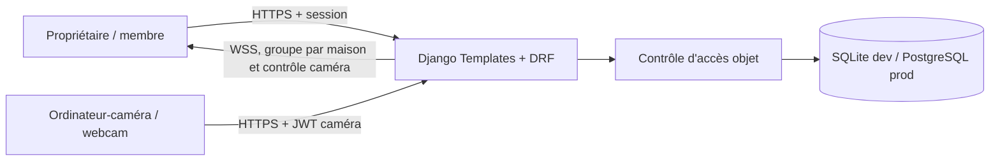
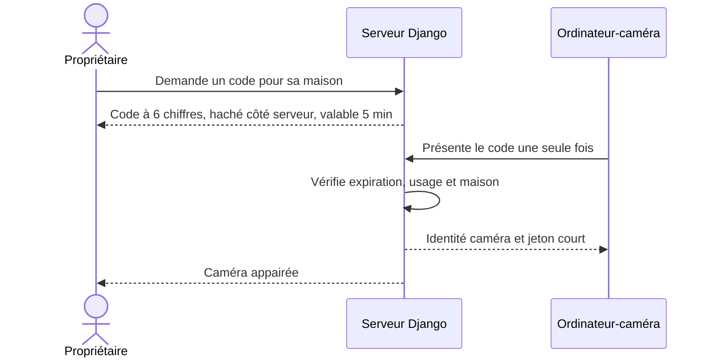
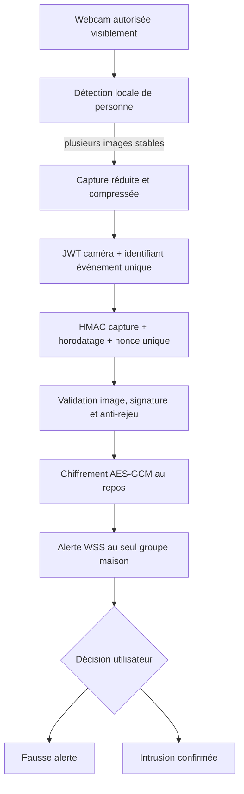
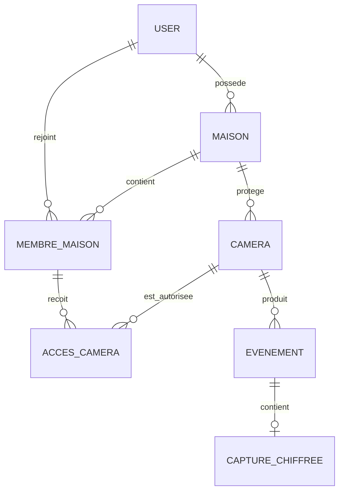

# Développement d’une plateforme web de maison intelligente avec mécanismes avancés de cybersécurité

Plateforme web académique transformant la webcam d’un ordinateur en caméra de surveillance, sans imposer l’achat de matériel IoT. Le navigateur de l’ordinateur-caméra effectuera l’analyse locale ; le serveur ne recevra que les événements et captures nécessaires aux alertes.

> État actuel : **Phases 1 à 5 terminées — Fondation, appairage, webcam, IA locale, alarmes temps réel et durcissement de sécurité**.

## Membres du groupe

- MUMBERE MITHIMBO DIEME
- LUANDA MURAIRI BERNARD
- BAZEBANZEA LIPEKENE ENOC
- MOMBIMBO N’SIESI XAVIER

## Fonctionnalités disponibles

- inscription, connexion et déconnexion avec sessions Django ;
- mots de passe hachés avec Argon2id ;
- création et consultation de maisons ;
- rôles propriétaire, membre de la famille et invité ;
- ajout de caméras identifiées par UUID ;
- code d’appairage à six chiffres, valable cinq minutes et utilisable une seule fois ;
- code et secret durable de caméra stockés uniquement sous forme de HMAC-SHA256 ;
- identité d’appareil distincte et JWT caméra signé valable cinq minutes ;
- renouvellement du JWT avec le secret durable de l’appareil ;
- consultation d’état et signal de présence limités à la caméra authentifiée ;
- révocation immédiate de l’identité, des anciens JWT et du secret caméra ;
- activation explicite de la webcam avec arrêt immédiat ;
- détection locale de la classe `person` avec TensorFlow.js et COCO-SSD ;
- bibliothèques d’inférence versionnées et servies localement pour garantir leur ordre et leur disponibilité ;
- validation sur trois images consécutives, seuil de confiance et délai anti-rafale ;
- capture redimensionnée et compressée, sans transmission continue du flux ;
- simulation de secours clairement marquée comme démonstration ;
- validation Pillow du contenu, du MIME, des dimensions et de la taille ;
- chiffrement AES-GCM des captures avec nonce unique et données associées ;
- signature HMAC-SHA256 indépendante de chaque détection, couvrant la capture, l’identifiant d’événement, l’horodatage et un nonce à usage unique ;
- rejet des signatures invalides, requêtes trop anciennes et rejeux de nonce ;
- historique initial des événements et accès objet aux captures ;
- alerte visuelle immédiate par WebSocket sur toutes les pages authentifiées, avec reconnexion automatique ;
- sirène d’intrusion à deux tons activable explicitement par l’utilisateur, désactivée par défaut et interruptible immédiatement ;
- classement irréversible d’une alerte en fausse alerte ou intrusion confirmée ;
- diffusion par maison avec seconde vérification d’accès à la caméra avant chaque envoi ;
- Redis chiffré au niveau applicatif en production et canal mémoire limité au développement ;
- autorisations explicites des membres par caméra ;
- activation de la surveillance réservée au propriétaire ;
- isolation des maisons et caméras dans les vues HTML et l’API REST ;
- tableau de bord responsive ;
- pages 403, 404 et 500 sans détails internes ;
- limitation de débit des connexions, inscriptions, appairages, renouvellements de jeton et détections ;
- journal d’audit des actions sensibles avec adresse IP pseudonymisée et métadonnées sensibles expurgées ;
- politique CSP sans script en ligne et restrictions explicites des permissions navigateur ;
- endpoint de santé `GET /health/`.

## Architecture



Le projet est un monolithe Django ASGI volontairement simple : `accounts` gère l’utilisateur personnalisé et `homes` porte les maisons, adhésions, caméras et permissions. Cette architecture réduit la surface d’attaque et reste facile à démontrer et déployer.

### Séquence d’appairage implémentée



### Flux de détection et d’alarme implémenté



### Relations principales



## Contrôles de sécurité déjà actifs

- CSRF sur tous les formulaires modifiant l’état ;
- cookies de session `HttpOnly`, `SameSite=Lax` et `Secure` en production ;
- redirection HTTPS configurable et prise en charge du proxy TLS ;
- en-têtes anti-sniffing, politique de référent stricte et refus d’intégration en iframe ;
- Argon2id en premier algorithme de hachage, PBKDF2 conservé uniquement pour migration ;
- requêtes `visible_to(user)` et formulaires dont les choix sont filtrés côté serveur ;
- UUID non séquentiels pour les caméras, sans les considérer comme un mécanisme d’autorisation ;
- codes à six chiffres hachés avec un pepper serveur séparé, expiration et revendication atomique ;
- secrets caméra aléatoires de forte entropie, conservés hachés côté serveur ;
- JWT HS256 avec émetteur, audience, sujet, expiration, identifiant unique et version révocable ;
- stockage des identifiants de l’ordinateur-caméra dans IndexedDB, jamais dans le `localStorage` humain ;
- validation puis normalisation JPEG des captures pour supprimer les métadonnées ;
- chiffrement authentifié AES-GCM avec clé de 256 bits, nonce aléatoire et identifiant d’événement associé ;
- refus d’un identifiant d’événement déjà utilisé ;
- HMAC-SHA256 indépendant du JWT sur une représentation canonique de la requête de détection ;
- fenêtre temporelle courte et nonce persistant à usage unique contre le rejeu ;
- déchiffrement à la demande uniquement après filtrage objet de l’événement ;
- WebSocket authentifié par la session Django et origine validée par `AllowedHostsOriginValidator` ;
- abonnement aux seuls groupes de maisons contenant une caméra visible, puis nouvelle autorisation objet avant chaque alerte ;
- décision d’alerte réservée au propriétaire ou à un membre ayant `peut_controler=True` ;
- couche Channels Redis obligatoire hors développement et messages Redis chiffrés avec une clé indépendante ;
- API REST limitée aux sessions authentifiées et filtrée avec les mêmes règles objet ;
- limitation de débit centralisable via Redis pour les opérations exposées aux essais automatisés ;
- journal d’audit immuable depuis l’administration, sans secret ni adresse IP brute ;
- CSP restrictive, `Permissions-Policy`, `Cross-Origin-Resource-Policy` et interdiction des objets et iframes ;
- variables d’environnement pour la configuration sensible.

WSS est prêt côté application et dépend du proxy TLS lors du déploiement. En production multi-processus, Redis est requis à la fois pour Channels et pour partager les compteurs de limitation de débit.

## Modèle de menace initial

| Menace | Contrôle actuel | Limite / suite |
|---|---|---|
| Utilisateur A modifie un UUID pour lire la caméra B | filtrage objet avant toute lecture HTML/API | tests automatisés actifs |
| Membre tente de contrôler une caméra en lecture seule | contrôle propriétaire sur l’action | permissions plus fines prévues |
| Soumission de formulaire intersite | jetons et middleware CSRF | HTTPS requis en production |
| Fuite de mot de passe après vol de base | Argon2id | politique MFA hors MVP |
| Fuite de secret Git | `.env` et données locales ignorés | gestionnaire de secrets de l’hébergeur requis |
| Vol/rejeu d’identité caméra | JWT court, version révocable, secret durable haché, HMAC d’événement, horodatage et nonce unique | protection du poste caméra et rotation des clés à formaliser |
| Lecture ou substitution d’une capture au repos | AES-GCM, nonce unique, données associées à l’événement et autorisation objet | rotation de clés à formaliser |
| Fuite d’une alerte vers une autre maison ou caméra | groupe WebSocket par maison, session authentifiée et vérification objet à chaque message | révocation de session centralisée à étudier |
| Coupure temporaire du réseau | reconnexion exponentielle du navigateur | Redis et supervision requis en production |

## API de l’ordinateur-caméra

- `POST /api/camera/appairer/` : échange un code temporaire contre l’identité initiale ;
- `POST /api/camera/token/` : renouvelle un JWT court avec l’identifiant et le secret appareil ;
- `GET /api/camera/me/etat/` : renvoie uniquement le nom, la maison et l’état de surveillance de la caméra authentifiée ;
- `POST /api/camera/me/presence/` : actualise sa dernière connexion.
- `POST /api/camera/me/detections/` : vérifie la signature HMAC et l’anti-rejeu, puis valide et chiffre une capture liée à une détection locale.

Les trois endpoints `me` exigent `Authorization: Bearer <jwt>`. La détection exige aussi `X-Camera-Timestamp`, `X-Camera-Nonce` et `X-Camera-Signature`. La clé HMAC indépendante est remise lors de l’appairage ou d’un renouvellement authentifié, puis conservée dans IndexedDB. Une caméra ne peut pas choisir un autre identifiant dans l’URL.

## Installation locale

Python 3.12 est la cible de référence. Django 5.2 LTS prend également en charge Python 3.14, utilisé lors de la validation locale initiale.

```powershell
python -m venv .venv
.\.venv\Scripts\Activate.ps1
python -m pip install -r requirements.txt
Copy-Item .env.example .env
python manage.py migrate
python manage.py runserver
```

Ouvrir ensuite `http://127.0.0.1:8000/`. La base SQLite locale convient uniquement au développement.

### Variables d’environnement

| Variable | Utilisation |
|---|---|
| `DJANGO_SECRET_KEY` | secret aléatoire obligatoire en production |
| `PAIRING_CODE_PEPPER` | secret indépendant pour hacher les codes temporaires |
| `CAMERA_CREDENTIAL_PEPPER` | secret indépendant pour hacher les secrets appareils |
| `CAMERA_JWT_SECRET` | clé HS256 indépendante d’au moins 32 octets |
| `CAMERA_TOKEN_TTL_SECONDS` | durée du JWT caméra, 300 secondes par défaut |
| `CAPTURE_ENCRYPTION_KEY` | clé AES-GCM de 32 octets encodée en base64 URL-safe |
| `EVENT_SIGNING_ENCRYPTION_KEY` | clé AES-GCM indépendante protégeant les clés HMAC des caméras au repos |
| `CAMERA_EVENT_MAX_SKEW_SECONDS` | écart maximal accepté pour l’horodatage d’une détection, 60 secondes par défaut |
| `AUDIT_LOG_PEPPER` | secret indépendant pour pseudonymiser les adresses IP du journal d’audit |
| `MAX_CAPTURE_BYTES` | taille maximale d’une image avant validation, 2 Mio par défaut |
| `DJANGO_DEBUG` | `False` en production |
| `DJANGO_ALLOWED_HOSTS` | hôtes séparés par des virgules |
| `DJANGO_CSRF_TRUSTED_ORIGINS` | origines HTTPS de confiance |
| `DATABASE_URL` | URL PostgreSQL en production |
| `REDIS_URL` | URL Redis obligatoire en production pour la couche Channels |
| `CHANNEL_ENCRYPTION_KEY` | clé indépendante d’au moins 32 octets pour chiffrer les messages transitant par Redis |
| `RATE_LIMIT_*` | seuils et fenêtres des limites de débit par opération sensible |
| `DJANGO_SECURE_SSL_REDIRECT` | force HTTPS |
| `DJANGO_SECURE_COOKIES` | cookies Secure |
| `DJANGO_SECURE_HSTS_SECONDS` | durée HSTS, `31536000` après validation HTTPS |

Le fichier `.env.example` ne contient que des valeurs fictives. `.env`, SQLite, médias, captures et fichiers statiques collectés sont exclus de Git.

Générer une vraie clé de chiffrement avant la production :

```powershell
python -c "import base64,secrets; print(base64.urlsafe_b64encode(secrets.token_bytes(32)).decode())"
```

Une modification de `CAPTURE_ENCRYPTION_KEY` rend les anciennes captures indéchiffrables. Une modification de `EVENT_SIGNING_ENCRYPTION_KEY` empêche de relire les clés HMAC déjà provisionnées. Leur rotation doit donc inclure une procédure de rechiffrement ou de réappairage contrôlé.

## Migrations et tests

```powershell
python manage.py makemigrations
python manage.py migrate
python manage.py test --verbosity 2
python manage.py check --deploy
```

Les 57 tests des Phases 1 à 5 vérifient notamment l’authentification, l’isolation objet et WebSocket entre maisons et caméras, l’appairage, les JWT, la révocation, le consentement webcam, l’ordre de chargement local du modèle IA, la validation d’image, AES-GCM, la signature HMAC, l’horodatage, l’anti-rejeu, la limitation de débit, le journal d’audit, CSP, la publication d’alerte et l’accès autorisé aux captures.

## Données de démonstration

La commande `python manage.py seed_demo` sera ajoutée en Phase 6. Elle utilisera uniquement des personnes, maisons, caméras et événements fictifs. Aucun identifiant de démonstration ne devra servir en production.

## Déploiement

Le projet est ASGI (`config.asgi:application`), compatible PostgreSQL via `DATABASE_URL`, servi avec Daphne, relié à Redis via `channels-redis` et préparé pour WhiteNoise. Sans `REDIS_URL`, un canal mémoire est utilisé uniquement en développement. Les fichiers `Procfile`, `build.sh`, `.python-version` et `render.yaml` fournissent maintenant une base de déploiement Render (un Redis managé doit être renseigné séparément). `DEBUG=False`, TLS, les cookies sécurisés, Redis et de vraies clés indépendantes sont obligatoires.

## Confidentialité, éthique et limites

- aucune webcam ne sera activée sans consentement visible ;
- aucun flux vidéo permanent ne sera transmis ou enregistré ;
- seules des scènes fictives, synthétiques ou jouées par le groupe seront utilisées ;
- aucune reconnaissance faciale, donnée biométrique, collecte de paiement ou action policière automatique ;
- la webcam, la détection locale, la simulation, les captures chiffrées, les alertes temps réel et les décisions utilisateur sont opérationnelles ;
- le canal en mémoire convient au développement, pas à plusieurs processus de production.

## Dépendances externes et licences

- [Django 5.2 LTS](https://docs.djangoproject.com/en/5.2/) — BSD-3-Clause ;
- [Django REST Framework](https://www.django-rest-framework.org/) — BSD-3-Clause ;
- [Django Channels](https://channels.readthedocs.io/) et [Daphne](https://github.com/django/daphne) — BSD ;
- [channels-redis](https://github.com/django/channels_redis) — BSD-3-Clause ;
- [WhiteNoise](https://whitenoise.readthedocs.io/) — MIT ;
- [dj-database-url](https://github.com/jazzband/dj-database-url) — BSD-2-Clause ;
- [Psycopg](https://www.psycopg.org/psycopg3/) — LGPL-3.0 avec exceptions ;
- [python-dotenv](https://github.com/theskumar/python-dotenv) — BSD-3-Clause ;
- [argon2-cffi](https://argon2-cffi.readthedocs.io/) — MIT ;
- [PyJWT](https://pyjwt.readthedocs.io/) — MIT ;
- [Pillow](https://pillow.readthedocs.io/) — MIT-CMU ;
- [Cryptography](https://cryptography.io/) — Apache-2.0 ou BSD-3-Clause ;
- [TensorFlow.js 4.22.0](https://www.npmjs.com/package/@tensorflow/tfjs) — Apache-2.0 ;
- [COCO-SSD 2.2.3](https://www.npmjs.com/package/@tensorflow-models/coco-ssd) — Apache-2.0.

Les versions exactes sont verrouillées dans `requirements.txt`.
